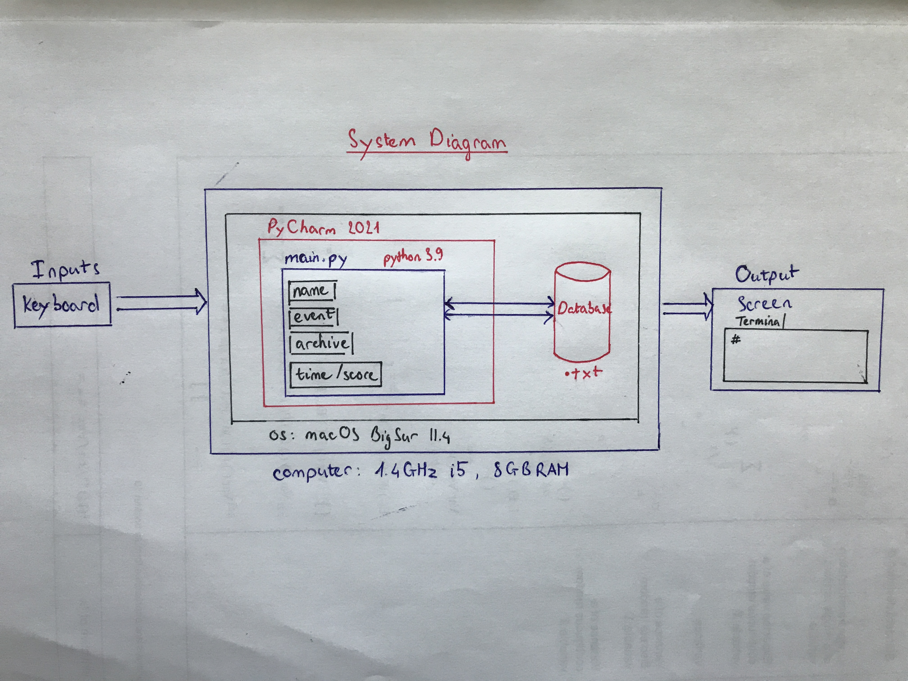
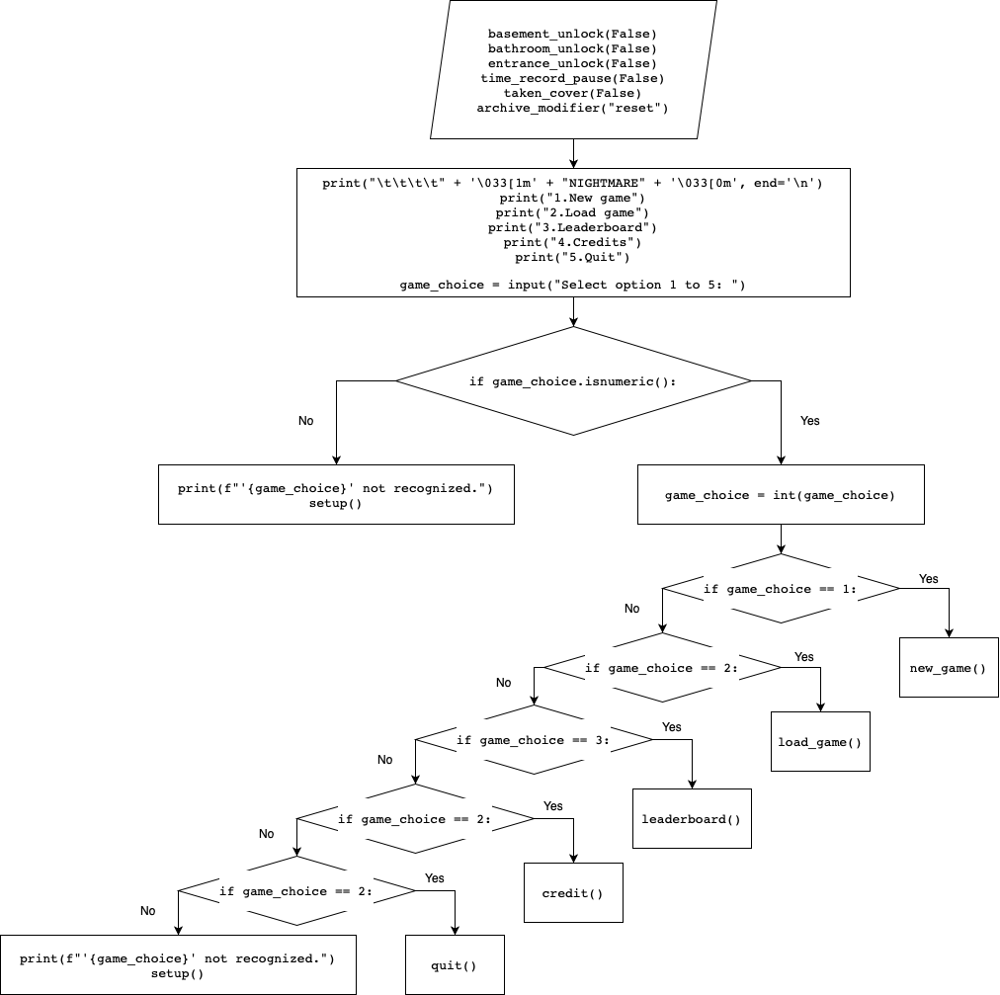
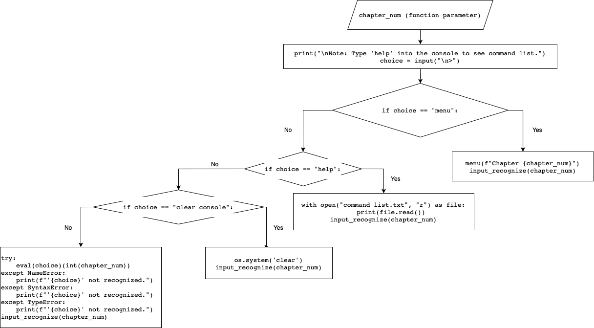
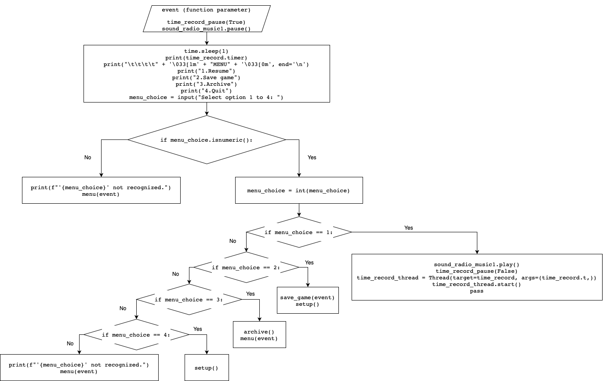

# Unit 1: A classic game 

# Criteria A: Planning

## Problem definition

The owner of the local game shop is an enthusiast of classic computer games. He has been looking for a talented programmer that can help him revive his passion for text-based games. He has few requirements for this task:

1. The game has to be entirely text-based.
2. The game must record the time played.
3. The game must record the player name and score.

Apart for this requirements, the owner is open to any type of game, topic or genre.

## Proposed Solution

I plan to design and mask a text-based game for a client who is an enthusiast of classic computer games. The game will belong to the horror genre that focuses on storytelling and puzzle solving, and will be constructed using PyCharm with the language Python. It will take 1 month to develop and will be evaluated according to the criteria.

The reason why I will be using Python is because it is the most common programming language and can run on almost any platform. Also, the program I’m developing on is PyCharm, an excellent IDE (integrated development environment) for Python. I believe that my solution will be effective as it is widely accessible as well as simple to navigate and understand.

## Success Criteria

1. The game has to be entirely text-based.
2. The game must record time played.
3. The game must record the player's name and score.
4. The game includes a menu that has a resume, save game, and quit function.
5. The game must include horror and puzzle solving elements.
6. The game must receive at least an 80% satisfaction rating.

# Criteria B: Design

## System Diagram

**Figure 1.** System diagram for the proposed solution

As shown in Fig. 1, the proposed solution will run on Python 3.9 and it is developed with PyCharm (v. 2021). The game is run on Macbook with a quad-care i5 1.4Ghz processor and 8GB of RAM, no GPU needed. The operating system is macOS BigSur 11.4. Input is through the keyboard and output is through the terminal console of PyCharm which is shown on the screen. The game, run by main.py will use some data such as name, event, archive, and time/score from the database, which is written in a ".txt" file.

## Flow Diagrams

### set_up function

**Figure 2.** Flow diagram of the set_up function

### input_recognize function

**Figure 3.** Flow diagram of the input_recognize function

### menu function

**Figure 4.** Flow diagram of the menu function

## Record of Tasks
| Task No | Planned Action          | Planned Outcome          | Time estimate | Target completion date | Criterion |
|---------|-------------------------|--------------------------|---------------|------------------------|-----------|
| 1       | write proposed solution | finish proposed solution | 20min         | Sept. 19th             | A         |
| 2       | create start menu       | finish start menu        | 1h            | Sept. 20th             | C         |
| 3       | create menu             | finish menu              | 1h30          | Sept. 22th             | C         |
| 4       | create system diagram   | finish system diagram    | 30min         | Sept. 24th             | B         |
| 5       | create save_game        | finish save_game         | 1h            | Sept. 27th             | C         |
| 6       | create load_game        | finish load_game         | 1h30          | Sept. 28th             | C         |
| 7       | write prologue          | finish prologue          | 30min         | Sept. 30th             | C         |
| 8       | write chapter 1         | finish chapter 1         | 1h30          | Sept. 30th             | C         |
| 9       | create archive          | finish archive           | 1h30          | Oct. 1st               | C         |
| 10      | write chapter 2         | finish chapter 2         | 1h            | Oct. 3rd               | C         |
| 11      | update system diagram   | finish system diagram    | 15min         | Oct. 6th               | B         |
| 12      | player testing          | aware of errors          | 30min         | Oct. 6th               | E         |
| 13      | bugs/errors fix         | fixed bugs/errors        | 1h30          | Oct. 6th               | C         |
| 14      | write chapter 3         | finish chapter 3         | 1h            | Oct. 9th               | C         |
| 15      | add sound effects       | added sfx library        | 2h            | Oct. 12th              | C         |
| 16      | implement sfx           | implemented sfx          | 1h30          | Oct. 12th              | C         |
| 17      | create name encoder     | implemented encoder      | 20min         | Oct. 13th              | C         |
| 18      | write chapter 4         | finish chapter 4         | 1h30          | Oct. 15th              | C         |
| 19      | write ch4 quest         | finish ch4 quest         | 4h30          | Oct. 16th              | C         |
| 20      | create game over        | finish game over         | 1h            | Oct. 18th              | C         |
| 21      | create credit           | finish credit            | 30min         | Oct. 18th              | C         |
| 22      | create flow diagrams    | finish flow diagrams     | 1h            | Oct. 21st              | B         |
| 23      | create leaderboard      | finish leaderboard       | 1h            | Oct. 23rd              | C         |
